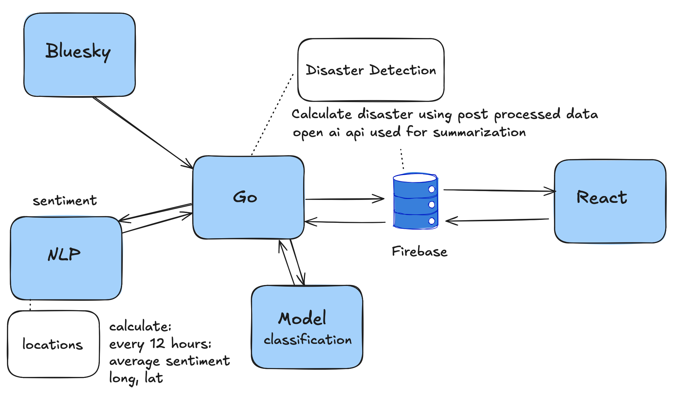

# go-firebird 

**go-firebird** is the backend service for the Firebird project. It's responsible for
ingesting data from the Bluesky social platform, processing skeets for sentiment and location,
detecting potential disaster events (wildfires, earthquakes, hurricanes),
summarizing them using LLMs, and storing all relevant information in Firestore.
This service provides the analytical backbone for the Firebird UI.

## Key Features

*   **Bluesky Data Ingestion:** Fetches skeets from specific disaster-related feeds on Bluesky.
*   **Sentiment Analysis:** Utilizes Google Cloud Natural Language API for sentiment scoring of skeets.
*   **Location Processing & Geocoding:** Extracts and aggregates location data from skeets, using Google Maps Geocoding API for address resolution.
*   **Disaster Detection:** Implements logic to identify potential disaster events based on
    sentiment velocity, skeet volume, and keyword analysis.
*   **LLM Summarization:** Generates concise summaries of detected disasters using OpenAI's API.
*   **Firestore Integration:** Persists processed skeets, location aggregates, and confirmed disaster data.
*   **API Endpoints:** Provides API endpoints for data fetching,
    disaster detection triggers, and test data management.
*   **Cron Jobs:** Supports scheduled tasks (e.g., periodic Bluesky feed fetching) in production environments.

## Tech Stack

*   **Language:** Go (Golang)
*   **Web Framework:** Gin
*   **Database:** Google Cloud Firestore
*   **NLP:** Google Cloud Natural Language API
*   **Geocoding:** Google Maps Geocoding API
*   **LLM:** OpenAI API
*   **Bluesky Interaction:** `github.com/bluesky-social/indigo/xrpc`
*   **Environment Management:** `github.com/joho/godotenv`
*   **Cron Jobs:** (Specify library if used, e.g., `github.com/robfig/cron/v3`)

## System Architecture / Data Flow

The following diagram illustrates the high-level data flow and component interactions within the Firebird backend and its connections to external services and the frontend.



## Prerequisites

Before you begin, ensure you have the following installed on your system:

*   **Go:** Version 1.18 or higher.
*   **Git:** For cloning the repository.
*   **Docker:** (Optional, for containerized deployment, not strictly required for local development as described here).

## 🚀 Getting Started & Contributing

This section guides you through setting up the project locally for development and how you can contribute.

### 1. Clone the Repository

```bash
git clone https://github.com/brayanMuniz/go-firebird.git
cd go-firebird
```

### 2. Set Up Environment Variables

The application requires API keys and configuration to interact with external services and define its behavior. Create a `.env` file in the project root (`go-firebird/.env`) and add the following variables:

```env
# OpenAI API Key for LLM summarization
OPENAI_API_KEY=your_openai_api_key

# Google Cloud Platform Configuration
# Path to your Google Cloud service account JSON key file.
# This key needs permissions for:
# - Firestore (e.g., Cloud Datastore User)
# - Cloud Natural Language API (e.g., Cloud Natural Language API User)
# - Google Maps Geocoding API (e.g., enable Geocoding API in your GCP project)
GOOGLE_APPLICATION_CREDENTIALS=/path/to/your/gcp-service-account-key.json

# Your Google Cloud Project ID where Firestore, NLP API, and Maps Geocoding API are enabled
FIRESTORE_PROJECT_ID=your-gcp-project-id

# URL of the client application (used for CORS or other configurations if needed)
CLIENT_URL=http://localhost:3000 # Or your deployed client URL

# Flag to indicate if running in a production environment (t for true, f or empty for false)
# This controls whether cron jobs are initialized.
PRODUCTION=f
```

*   Replace placeholder values with your actual credentials and paths.
*   Ensure the Google Cloud service account has the necessary permissions.

> NOTE: I base64 encoded the FIREBASE_CREDENTIALS and NATURAL_LANGUAGE_CREDENTIALS and decode them 
at run time. Reason: I just wanted to add the env variables as a field to fly.io

### 3. Install Dependencies

Fetch and install the necessary Go modules:

```bash
go mod tidy
```

### 4. Build the Project

Compile the Go application:

```bash
go build -o firebird-server main.go
```
This will create an executable named `firebird-server` in the project root.

### 5. Running the Application

#### Application Initialization Workflow (`main.go`)

When the application starts, `main.go` performs the following initialization steps:
1.  Loads environment variables from the `.env` file.
2.  Initializes the Google Maps Geocoding client.
3.  Initializes the Google Cloud Firestore client.
4.  Initializes the Google Cloud Natural Language API client.
5.  If the `PRODUCTION` environment variable is set to `"t"`, it initializes and starts cron jobs (e.g., for periodic Bluesky feed fetching).
6.  Sets up the Gin router with all defined API routes.
7.  Starts the HTTP server, typically listening on port `:8080`.

#### Running the Server

You can run the compiled server:

```bash
./firebird-server
```
Alternatively, for development with live reloading, you can use `air` (see instructions below) or run directly:

```bash
go run main.go
```

### 6. Running with Air (for Hot Reloading during Development)

Air monitors your Go files for changes and automatically rebuilds and restarts the application.

#### Install Air

If you don't have Air installed, run:

```bash
go install github.com/cosmtrek/air@latest
```

**Ensure `$GOPATH/bin` is in your system's PATH:**
(Refer to the original installation instructions in your previous README snippet for OS-specific PATH setup if needed.)

#### Initialize Air (One-time Setup)

If an `.air.toml` configuration file doesn't already exist, you can generate one (though one is likely already included in the repository):

```bash
air init
```

#### Start Development Server with Air

```bash
air
```

### 🤝 Submitting Contributions

If you'd like to contribute to Firebird Core:

1.  **Fork the repository** on GitHub.
2.  **Create a new branch** for your feature or bug fix (`git checkout -b feature/your-feature-name` or `git checkout -b fix/your-bug-fix`).
3.  **Make your changes** and commit them with clear, descriptive messages.
4.  **Ensure all tests pass** (`go test ./...`).
5.  **Push your branch** to your forked repository (`git push origin feature/your-feature-name`).
6.  **Open a pull request** from your forked repository's branch to the `main` branch of the `brayanMuniz/go-firebird` repository.
7.  Provide a clear description of your changes in the pull request.

We appreciate your contributions!
